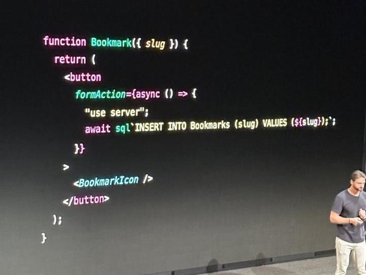

# 前端精选#16 又见 PHP？

欢迎来到《前端精选》，这里记录有趣的见闻，每周一发布。

# 封面

NextJS 新用法

# 话题

**又见 PHP？**

本周 NextJS 14发布，网上流传的一张在 React 组件里写 SQL 的图引起了广泛讨论，初看时，这种前端代码里嵌入后端代码非常眼熟，恍若 PHP/JSP/ASP 再现，再看其实有不一样，它在保证前端体验的同时，消除了 API 层，使逻辑更集中。这在简单项目里无疑是有优势的，但是在复杂项目中，还是免不了分层，可能收益有限。我认为这可以堪称是既 GraphQL 后，对传统 Web 服务架构又一次挑战的尝试。

你有哪些关于 NextJS 后端代码写法的思考，欢迎留言讨论。

# 见闻

1. [Reactive-Resume - 在线简历](https://github.com/AmruthPillai/Reactive-Resume)

这是一个在线简历制作工具，可以方便的做出漂亮的简历，并且可以托管在它的网站上。

2. [jsPDF - 生成 PDF 的 JS 库](https://github.com/parallax/jsPDF)

这个 JS 库可以方便的生成 PDF，可以用于某些表单、文字导出场景。

3. [request-animation-frames - 将 requestAnimationFrame 转为异步迭代器](https://github.com/sindresorhus/request-animation-frames)

这个库将 requestAnimationFrame 函数转成了异步迭代器，因而可以使用 async 语法，避免写递归调用。

4. [实现验证码输入控件](https://phuoc.ng/collection/html-dom/build-an-otp-input-field/)

现在很多系统登录可要求输入收到的验证码，样式是4个短横线，每个位置输入1个数字，这种控件如何开发呢，本文详细地介绍了其实现方法。

5. [彩虹缩进插件](https://marketplace.visualstudio.com/items?itemName=oderwat.indent-rainbow)

这是一个 VSCode 插件，用彩色显示出不同的缩进，就像彩虹一样，便于快速看出缩进级别。

6. [可交互的 CSS Grip 教程](https://www.joshwcomeau.com/css/interactive-guide-to-grid/)

这篇文档文章系统介绍了 CSS Grip 用法，文章还带有较多的可交互的示例。

7. [CSS 嵌套](https://ishadeed.com/article/css-nesting)

现代浏览器开始原生支持 CSS 嵌套，本文介绍了一下例子，还给出对应不嵌套写法作为对比。

8. [始学习 CSS 容器查询](https://developer.mozilla.org/en-US/blog/getting-started-with-css-container-queries/)

本文介绍了容器查询 (@container) 的产生背景和用法，相对于屏幕查询 (@media screen)，对样式有着更细粒度的控制。

9. [你的网站的网址可以而且应该是漂亮的](https://opuszine.us/posts/your-websites-urls-can-should-be-beautiful)

本文介绍了一些让网站 URL 变得好看的思考，需要在简洁和易懂上平衡，并介绍了一些方法，例如尽可能少的分段（即斜线少）、省略不影响语义词等。

10. [代码之谷](https://thevalleyofcode.com/)

这是一个通用计算机知识教程，包含开发中常用的技术介绍，适合闲暇时浏览。
